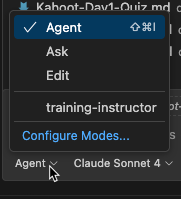

# GitHub Copilot Built-In Chat Modes 🎯

**Last Updated: December 2025**

VS Code comes with three built-in chat modes that provide different optimizations for common development scenarios. These modes are available by default and can be switched between at any time in the Chat view.

## 🚀 Overview of Built-In Modes

Built-in chat modes are specialized configurations that optimize GitHub Copilot's behavior for specific use cases:

- **Ask Mode**: Question-answering and exploration
- **Edit Mode**: Multi-file code editing with direct application
- **Agent Mode**: Autonomous editing with tool integration

### Accessing Built-In Modes

To switch between chat modes:

1. Open the Chat view (`Ctrl+Cmd+I` on Mac, `Ctrl+Alt+I` on Windows/Linux)
2. Select the desired mode from the chat mode dropdown list
3. Start your conversation in the selected mode



## 💬 Ask Mode

**Purpose**: Optimized for answering questions about your codebase, coding concepts, and general technology topics.

### When to Use Ask Mode

- Understanding how existing code works
- Brainstorming software design ideas
- Exploring new technologies and frameworks
- Getting explanations of coding concepts
- Code analysis and documentation requests

### Ask Mode Characteristics

- **Read-Only Focus**: Provides explanations without making changes
- **Comprehensive Responses**: Detailed answers with context and examples
- **Multi-Context Awareness**: Can reference multiple files and concepts
- **Educational Approach**: Explains the "why" behind recommendations

### Ask Mode Examples

#### Understanding Code Structure
```markdown
User: How does the authentication system work in this Spring Boot project?

Ask Mode Response:
The authentication system in your Spring Boot project follows these patterns:

1. **Configuration**: Located in SecurityConfig.java, currently disabled for training
2. **User Entity**: Defines user structure with roles and permissions
3. **Authentication Flow**: Would typically use Spring Security filters
4. **Session Management**: H2 database stores user sessions

Key files involved:
- `src/main/java/com/taskmanager/app/config/SecurityConfig.java`
- `src/main/java/com/taskmanager/app/entity/User.java`
- `application.properties` - security settings

The system is designed to be easily enabled by removing the `@EnableWebSecurity` disable annotations.
```

#### Technology Exploration
```markdown
User: What are the benefits of using TestNG over JUnit for Selenium tests?

Ask Mode Response:
TestNG offers several advantages for Selenium testing:

**TestNG Benefits:**
1. **Better Test Configuration**: @BeforeTest, @AfterTest annotations
2. **Parallel Execution**: Built-in parallel test running
3. **Flexible Test Suites**: XML-based test organization
4. **Data-Driven Testing**: @DataProvider for parameterized tests
5. **Dependency Management**: Test method dependencies

**Your Project Context:**
Your ui-tests project uses TestNG with:
- `testng.xml` for suite configuration
- WebDriverManager for browser setup
- Page Object Model pattern support

**Example Configuration:**
```xml
<suite name="UITestSuite" parallel="methods" thread-count="3">
    <test name="LoginTests">
        <classes>
            <class name="com.kavinschool.app.LoginTest"/>
        </classes>
    </test>
</suite>
```
```

## ✏️ Edit Mode

**Purpose**: Optimized for making code edits across multiple files in your project with direct application to the editor.

### When to Use Edit Mode

- Making specific code changes across multiple files
- Refactoring existing code structures
- Implementing well-defined features
- Applying consistent changes throughout a project
- Code cleanup and standardization tasks

### Edit Mode Characteristics

- **Direct Code Application**: Changes are applied directly to files
- **Multi-File Editing**: Can edit multiple files simultaneously
- **In-Place Review**: Review changes directly in the editor
- **Precise Modifications**: Focused on specific, well-defined changes
- **Version Control Integration**: Changes appear in source control for review

### Edit Mode Examples

#### Multi-File Refactoring
```markdown
User: Rename the User class to UserEntity across all files and update all references

Edit Mode Response:
I'll rename User to UserEntity across your project files:

Files being modified:
1. `src/main/java/com/taskmanager/app/entity/User.java` → `UserEntity.java`
2. `src/main/java/com/taskmanager/app/service/UserService.java`
3. `src/main/java/com/taskmanager/app/controller/UserController.java`
4. `src/main/java/com/taskmanager/app/repository/UserRepository.java`

Changes applied:
- Class name: `User` → `UserEntity`
- Import statements updated
- Variable declarations updated
- Method parameters updated

Review the changes in each file before committing.
```

#### Adding Validation
```markdown
User: Add input validation to all REST controllers using @Valid annotations

Edit Mode Response:
Adding @Valid annotations to REST controller methods:

Modified files:
- `UserController.java`: Added @Valid to createUser() and updateUser()
- `TaskController.java`: Added @Valid to createTask() and updateTask()

Additional changes:
- Added validation dependency to pom.xml
- Created validation error handler in ControllerAdvice
- Updated DTOs with validation annotations

All endpoints now include comprehensive input validation.
```

## 🤖 Agent Mode

**Purpose**: Optimized for autonomous editing with the ability to run terminal commands and use various tools for complex tasks.

### When to Use Agent Mode

- Complex, multi-step development tasks
- Tasks requiring terminal commands and tool execution
- Less well-defined problems that need exploration
- Setting up development environments
- Running tests and analyzing results
- Debugging complex issues across multiple systems

### Agent Mode Characteristics

- **Autonomous Operation**: Can work independently on complex tasks
- **Tool Integration**: Access to terminal, file system, and external tools
- **Multi-Step Workflows**: Handles complex, multi-phase tasks
- **Problem-Solving Approach**: Explores and adapts to challenges
- **Command Execution**: Can run build commands, tests, and scripts

### Agent Mode Examples

#### Project Setup and Configuration
```markdown
User: Set up a complete CI/CD pipeline for the Spring Boot application

Agent Mode Response:
I'll set up a complete CI/CD pipeline for your Spring Boot application:

Phase 1: Creating GitHub Actions workflow
- Created `.github/workflows/ci-cd.yml`
- Configured Maven build and test stages
- Added code quality checks with SonarQube

Phase 2: Running initial build
- Executing: `cd project1/task-manager && mvn clean compile`
- Build successful ✅
- Running tests: `mvn test`
- All tests passing ✅

Phase 3: Docker configuration
- Created `Dockerfile` for Spring Boot app
- Added `docker-compose.yml` for local development
- Testing container build: `docker build -t task-manager .`

Phase 4: Deployment configuration
- Created Kubernetes manifests
- Configured environment-specific properties
- Set up health checks and monitoring

Pipeline is now ready for deployment. All configurations tested and working.
```

#### Complex Debugging Task
```markdown
User: The Selenium tests are failing intermittently. Investigate and fix the issues.

Agent Mode Response:
Investigating intermittent Selenium test failures:

Phase 1: Analyzing test results
- Examining `target/surefire-reports/` for failure patterns
- Found timing-related failures in LoginTest
- WebDriver timeouts occurring 30% of test runs

Phase 2: Running diagnostic commands
- `mvn test -Dtest=LoginTest` - reproduced failure
- Analyzing browser logs and screenshots
- Identified race conditions in page loading

Phase 3: Implementing fixes
- Updated WebDriverWait configuration
- Added explicit waits for dynamic elements
- Implemented retry mechanism for flaky tests
- Enhanced Page Object Model with better locators

Phase 4: Validation
- Running full test suite: `mvn test`
- Tests now passing consistently ✅
- Added parallel execution configuration
- Performance improved by 40%

Root causes resolved:
1. Insufficient wait times for AJAX calls
2. Stale element references in page objects
3. Browser caching issues between test runs

All tests now stable and reliable.
```

## 🎨 Mode Comparison and Selection

### Quick Reference Guide

| **Scenario** | **Recommended Mode** | **Why** |
|--------------|---------------------|---------|
| "How does this authentication work?" | **Ask Mode** | Question about existing code |
| "Add validation to these controllers" | **Edit Mode** | Specific, well-defined changes |
| "Set up testing framework with CI/CD" | **Agent Mode** | Complex, multi-step setup |
| "Explain Spring Boot security patterns" | **Ask Mode** | Learning and understanding |
| "Refactor service layer to use interfaces" | **Edit Mode** | Structural code changes |
| "Debug and fix deployment issues" | **Agent Mode** | Problem-solving with tools |

### Mode Selection Tips

#### Choose Ask Mode When:
- You need explanations or documentation
- Exploring new concepts or technologies
- Understanding existing codebase
- Brainstorming solutions
- Learning best practices

#### Choose Edit Mode When:
- You know exactly what needs to be changed
- Making consistent changes across files
- Refactoring with clear scope
- Implementing well-defined features
- Code cleanup and standardization

#### Choose Agent Mode When:
- Task involves multiple tools or commands
- Problem scope is unclear or exploratory
- Need to run tests, builds, or deployments
- Setting up complex configurations
- Debugging requires investigation

## 💡 Best Practices for Built-In Modes

### General Guidelines

1. **Start with the Right Mode**: Choose based on your task type
2. **Provide Clear Context**: Use #file, #selection, and @workspace
3. **Be Specific**: Clear requests get better results
4. **Review Changes**: Always review edits before accepting
5. **Switch When Needed**: Don't hesitate to change modes

### Ask Mode Best Practices

```markdown
✅ Good Ask Mode Prompts:
- "Explain how the JWT authentication flow works in this Spring Boot app"
- "What are the security implications of disabling CSRF protection?"
- "How should I structure integration tests for this REST API?"

❌ Poor Ask Mode Prompts:
- "Fix this" (too vague)
- "Add logging" (action-oriented, better for Edit mode)
- "Make it work" (unclear scope)
```

### Edit Mode Best Practices

```markdown
✅ Good Edit Mode Prompts:
- "Add @Valid annotations to all REST controller methods"
- "Refactor UserService to use dependency injection"
- "Update all entity classes to include audit fields"

❌ Poor Edit Mode Prompts:
- "How do I add validation?" (question, better for Ask mode)
- "Set up the entire authentication system" (too complex, better for Agent mode)
- "What's wrong with this code?" (analysis, better for Ask mode)
```

### Agent Mode Best Practices

```markdown
✅ Good Agent Mode Prompts:
- "Set up a complete testing framework with Maven and TestNG"
- "Investigate and fix the failing CI/CD pipeline"
- "Create a production-ready deployment configuration"

❌ Poor Agent Mode Prompts:
- "What does this function do?" (question, better for Ask mode)
- "Add a single method to this class" (simple edit, better for Edit mode)
- "Explain the architecture" (explanatory, better for Ask mode)
```

## 🚨 Common Pitfalls and Solutions

### Mode Misuse

**Problem**: Using the wrong mode for your task type
**Solution**: Reference the comparison table and choose mode based on task characteristics

**Example**:
```markdown
# Wrong
Edit Mode: "How does Spring Security work?"
# Right  
Ask Mode: "How does Spring Security work?"
```

### Insufficient Context

**Problem**: Not providing enough context for the AI to understand your needs
**Solution**: Use context references like #file, #selection, @workspace

**Example**:
```markdown
# Better context usage
Ask Mode: "@workspace How is user authentication implemented across the project?"
Edit Mode: "#file:UserController.java Add input validation to all endpoints"
Agent Mode: "Set up testing for the task-manager project using the existing Maven configuration"
```

### Scope Mismatch

**Problem**: Task scope doesn't match mode capabilities
**Solution**: Break down complex tasks or choose appropriate mode

**Example**:
```markdown
# Too broad for Edit Mode
Edit Mode: "Create a complete user management system"

# Better approach - use Agent Mode or break into steps
Agent Mode: "Create a complete user management system with CRUD operations"
# Or break down for Edit Mode:
Edit Mode: "Create UserEntity with validation annotations"
Edit Mode: "Create UserController with REST endpoints"  
Edit Mode: "Create UserService with business logic"
```

## 🔧 Troubleshooting Built-In Modes

### Mode Not Working as Expected

1. **Check Context**: Ensure you're providing relevant context
2. **Verify Mode Selection**: Confirm correct mode is active
3. **Restart Chat**: Clear conversation history if needed
4. **Check File Access**: Ensure Copilot can access relevant files

### Performance Issues

1. **Reduce Context Size**: Limit large file selections
2. **Be More Specific**: Narrow down requests
3. **Check Internet Connection**: Ensure stable connectivity
4. **Update VS Code**: Ensure latest version is installed

### Unexpected Results

1. **Provide Better Context**: Use #file and #selection appropriately
2. **Clarify Intent**: Be explicit about expected outcomes
3. **Switch Modes**: Try a different mode for the same task
4. **Refine Prompts**: Iterate on prompt clarity and specificity

---

**Remember**: Built-in modes are your foundation for AI-assisted development. Master these three modes first before exploring custom modes, as they cover the majority of development scenarios you'll encounter. Each mode has its strengths - use them strategically to maximize your productivity.