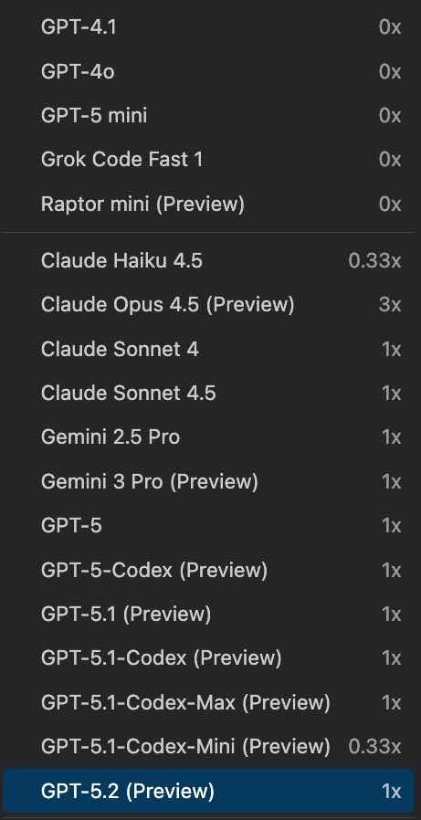

# GitHub Copilot Chat Models

## Overview

GitHub Copilot Chat provides access to multiple AI models, each optimized for different types of tasks and use cases. This guide helps you understand the capabilities and best use cases for each available model.

---

## Models Menu Screenshot



---

## Models From Screenshot (purposes)

| Model                        | Purpose                               | Notes                                    |
| ---------------------------- | ------------------------------------- | ---------------------------------------- |
| GPT-4.1                      | General coding and reasoning          | Balanced quality and speed               |
| GPT-4o                       | Multimodal, strong coding + reasoning | Great for complex tasks and explanations |
| GPT-5 mini                   | Lightweight coding helper             | Quick replies for simple edits           |
| Grok Code Fast 1             | Fast code-oriented draft              | Best for quick scaffolding               |
| Raptor mini (Preview)        | Lightweight general assistant         | Good for quick Q&A                       |
| Claude Haiku 4.5             | Fast, concise responses               | Great for short iterations               |
| Claude Opus 4.5 (Preview)    | Advanced reasoning                    | Use for deeper analysis                  |
| Claude Sonnet 4              | General-purpose coding                | Solid balance of speed and quality       |
| Claude Sonnet 4.5            | Upgraded Sonnet for coding            | Better quality while staying quick       |
| Gemini 2.5 Pro               | General-purpose multimodal            | Good for mixed tasks and docs            |
| Gemini 3 Pro (Preview)       | Newer Gemini with broader skills      | Try for broad reasoning                  |
| GPT-5                        | General-purpose, stronger reasoning   | Versatile across coding and docs         |
| GPT-5-Codex (Preview)        | Coding-specialized GPT-5              | Use for code generation and refactors    |
| GPT-5.1 (Preview)            | Improved GPT-5 reasoning              | Better step-by-step answers              |
| GPT-5.1-Codex (Preview)      | Coding-focused GPT-5.1                | Strong for debugging and tests           |
| GPT-5.1-Codex-Max (Preview)  | High-capacity coding                  | Use when context is large                |
| GPT-5.1-Codex-Mini (Preview) | Lightweight coding                    | Fast, small tasks                        |
| GPT-5.2 (Preview)            | Latest general-purpose                | Try for toughest reasoning tasks         |

---

## Available Models

### 1. **Claude 3.5 Sonnet** (Default)

**Purpose**: General-purpose coding and development assistance

**Best For**:
- Writing and refactoring code
- Generating boilerplate and scaffolding
- Quick code explanations
- Debugging and fixing errors
- Creating test cases
- Documentation generation

**Characteristics**:
- Fast response times
- Excellent at code generation and understanding
- Great for day-to-day development tasks
- Balanced between speed and quality
- Handles large codebases efficiently

**Example Use Cases**:
- "Write a function to calculate Fibonacci numbers"
- "Explain this error message"
- "Generate unit tests for this class"
- "Refactor this code for better readability"

---

### 2. **GPT-4o** (Advanced Multi-Modal)

**Purpose**: Advanced reasoning and complex problem-solving

**Best For**:
- Complex architectural decisions
- Technical design discussions
- Advanced debugging scenarios
- Learning complex concepts
- Analyzing code patterns across large projects
- Understanding legacy systems

**Characteristics**:
- More advanced reasoning capabilities
- Better at understanding context and nuance
- Handles complex multi-step problems
- Excellent for explaining "why" not just "how"
- Better at catching edge cases and potential issues

**Example Use Cases**:
- "Design a microservices architecture for this application"
- "Why would this code cause a memory leak in production?"
- "What's the best pattern to implement this requirement?"
- "Analyze this system and suggest optimizations"

---

### 3. **o1** (Deep Reasoning)

**Purpose**: Complex reasoning and problem-solving with extended thinking

**Best For**:
- Very complex algorithmic problems
- Advanced mathematical computations
- Complex system design decisions
- Performance optimization analysis
- Security vulnerability analysis
- Deep code analysis and refactoring strategies

**Characteristics**:
- Performs extended reasoning before answering
- Best for problems requiring deep analysis
- Slower but more thorough responses
- Excellent for non-coding complex problems
- High accuracy on difficult problems

**Example Use Cases**:
- "Optimize this algorithm for better time complexity"
- "Conduct a security audit of this codebase"
- "Design a solution for this complex business requirement"
- "Analyze performance bottlenecks in this system"

---

## Model Comparison Table

| Aspect              | Claude 3.5 Sonnet | GPT-4o           | o1            |
| ------------------- | ----------------- | ---------------- | ------------- |
| **Speed**           | ⚡ Very Fast      | ⚡⚡ Fast        | 🐢 Slower    |
| **Coding**          | ⭐⭐⭐⭐⭐        | ⭐⭐⭐⭐⭐       | ⭐⭐⭐⭐      |
| **Reasoning**       | ⭐⭐⭐⭐          | ⭐⭐⭐⭐⭐       | ⭐⭐⭐⭐⭐    |
| **Cost**            | $                 | $$               | $$$           |
| **Best For**        | Daily development | Complex problems | Deep analysis |
| **Context Size**    | Large             | Very Large       | Large         |
| **Response Length** | Medium            | Medium-Long      | Long          |

---

## How to Switch Models

### In GitHub Copilot Chat (VS Code)

1. Open Copilot Chat panel
2. Look for the model selector at the top of the chat window
3. Click on the current model name
4. Select your preferred model from the dropdown

### Best Practices for Model Selection

**Use Claude 3.5 Sonnet when**:
- You need quick answers
- Working on routine coding tasks
- You want real-time feedback
- Time is critical

**Use GPT-4o when**:
- You need better understanding of complex topics
- Making architectural decisions
- Analyzing unfamiliar code
- Teaching or learning mode

**Use o1 when**:
- Solving very complex problems
- Need thorough analysis
- Working on performance-critical sections
- Security-related concerns

---

## Tips for Effective Model Usage

### 1. **Provide Context**
```
Good: #file: main.ts [describe your issue]
Less Good: "How do I fix this?"
```

### 2. **Be Specific**
```
Good: "Write a TypeScript function that validates email addresses using regex"
Less Good: "Write validation code"
```

### 3. **Use `@` Mentions** (for available participants)
- `@workspace` - Include workspace context
- `@terminal` - Reference terminal output
- `@vscode` - VS Code specific help

### 4. **Iterate and Refine**
- Start with your initial question
- Ask follow-up questions for clarification
- Request modifications to generated code

### 5. **Use Chat Slash Commands**
```
/explain - Explain selected code
/fix - Fix problems in selected code
/test - Generate tests
/doc - Generate documentation
```

---

## Common Use Case Scenarios

### Scenario 1: Daily Development
**Model**: Claude 3.5 Sonnet
```
"Create a React component for a login form with email and password validation"
```

### Scenario 2: System Architecture
**Model**: GPT-4o
```
"#file: current-architecture.md 
How should I restructure this monolithic application into microservices?"
```

### Scenario 3: Performance Optimization
**Model**: o1
```
"#file: slow-function.ts 
This function handles 1M+ records. Analyze and suggest optimization strategies."
```

---

## Key Takeaways

- **Claude 3.5 Sonnet** = Speed and efficiency for everyday coding
- **GPT-4o** = Advanced reasoning for complex problem-solving
- **o1** = Deep analysis for the most challenging problems

Choose the right model for your task to get the best results efficiently!

---

## Resources

- [GitHub Copilot Documentation](https://docs.github.com/copilot)
- [Copilot Chat Participants](./Copilot-Chat-Participants.md)
- [Copilot Slash Commands](./Copilot-Slash-Commands.md)
- [Copilot Custom Instructions](./Copilot-Custom-Instructions.md)
