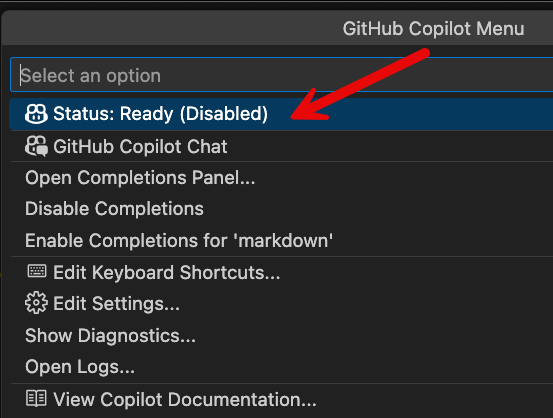

# GitHub Copilot Enable/Disable Controls

**Last Updated: September 2025**

GitHub Copilot provides flexible control options to enable or disable its features at various levels, from global settings to language-specific and context-aware controls.

## Quick Toggle Methods

### Status Bar Control
The fastest way to control Copilot is through the status bar icon in the bottom right of VS Code.


**Available Options:**
- **Globally Enabled**: Copilot active for all languages and contexts
- **Globally Disabled**: Copilot completely turned off
- **Disabled for [Language]**: Language-specific disabling (e.g., "Disabled for Python")
- **Disabled for [Repository]**: Repository-specific disabling

### Re-enabling Copilot
Click the status bar icon again and select the appropriate option to re-enable:



## Granular Control Options

### Language-Specific Controls

#### Via Command Palette
1. Open Command Palette (`Cmd+Shift+P` / `Ctrl+Shift+P`)
2. Search for "Copilot: Enable/Disable Completions"
3. Choose language-specific options

#### Via Settings
```json
{
  "github.copilot.enable": {
    "*": true,
    "yaml": false,
    "plaintext": false,
    "markdown": false,
    "javascript": true,
    "typescript": true,
    "python": true
  }
}
```

### Repository-Specific Controls

#### .copilotignore File
Create a `.copilotignore` file in your repository root:

```gitignore
# Disable Copilot for specific files
secrets/
*.env
config/production/*
*.key
*.pem

# Disable for specific file types
*.sql
*.json
*.xml

# Disable for directories
vendor/
node_modules/
build/
```

#### Repository Settings
```json
{
  "github.copilot.enable": {
    "*": false  // Disable for entire repository
  }
}
```

## Advanced Control Features

### Context-Aware Disabling

#### Chat Participants Control
```json
{
  "github.copilot.chat.participants.enabled": {
    "@workspace": true,
    "@terminal": false,
    "@github": true,
    "@vscode": true
  }
}
```

#### Feature-Specific Controls
```json
{
  "github.copilot.editor.enableAutoCompletions": false,
  "github.copilot.chat.followUps": false,
  "github.copilot.editor.enableCodeActions": false,
  "github.copilot.renameSuggestions.triggerAutomatically": false
}
```

### Editing Session Controls
```json
{
  "chat.editing.enabled": false,
  "chat.editing.confirmEditRequestRemoval": true,
  "chat.editing.alwaysSaveWithGeneratedChanges": false
}
```

## Enterprise and Team Controls

### Organization-Level Policies
Enterprise administrators can set organization-wide policies:

#### Repository Access Control
- **Allow all repositories**: Copilot enabled for all org repositories
- **Selected repositories only**: Whitelist specific repositories
- **Block repositories**: Blacklist sensitive repositories

#### Feature Restrictions
```json
{
  "github.copilot.enterprise.policies": {
    "codeCompletion": "enabled",
    "chatFeatures": "restricted",
    "editingSessions": "disabled",
    "publicRepositories": "blocked"
  }
}
```

### Team-Level Configuration
```json
{
  "github.copilot.team.settings": {
    "defaultState": "enabled",
    "languageRestrictions": ["sql", "bash"],
    "sensitiveFilePatterns": ["*.env", "*.key", "config/*"],
    "requireApproval": ["editing-sessions", "code-generation"]
  }
}
```

## Temporary Disabling Strategies

### Session-Based Control
```markdown
# Quick temporary disable commands:
- Cmd/Ctrl + Shift + \ : Toggle Copilot globally
- Status bar click : Quick language/context toggle
- Command Palette : "Copilot: Disable Globally"
```

### Focus Mode
For distraction-free coding without AI assistance:

```json
{
  "github.copilot.focusMode": {
    "enabled": true,
    "disableCompletions": true,
    "disableChat": false,
    "showStatusBar": false
  }
}
```

## Privacy and Security Controls

### Data Transmission Controls
```json
{
  "github.copilot.privacy": {
    "blockSensitiveData": true,
    "excludePatterns": ["*.env", "*.key", "secrets/*"],
    "requireExplicitConsent": true,
    "auditLogging": true
  }
}
```

### Code Analysis Restrictions
```json
{
  "github.copilot.codeAnalysis": {
    "enableTelemetry": false,
    "enableUsageTracking": false,
    "enablePerformanceMonitoring": false
  }
}
```

## Conditional Disabling

### File Pattern-Based Control
```json
{
  "github.copilot.enable": {
    "*": true,
    "**/*.env": false,
    "**/*.key": false,
    "**/secrets/**": false,
    "**/config/production/**": false,
    "**/*.sql": false
  }
}
```

### Project Type-Based Control
```json
{
  "github.copilot.projectTypeRules": {
    "financial": {
      "enabled": false,
      "reason": "Compliance requirements"
    },
    "healthcare": {
      "chatOnly": true,
      "noCodeGeneration": true
    },
    "opensource": {
      "fullFeatures": true
    }
  }
}
```

## Monitoring and Auditing

### Usage Tracking
```json
{
  "github.copilot.audit": {
    "enableUsageTracking": true,
    "logAcceptedSuggestions": true,
    "logRejectedSuggestions": true,
    "trackChatInteractions": true
  }
}
```

### Compliance Reporting
Enterprise features include:
- Usage analytics and reporting
- Code generation audit trails
- Security compliance dashboards
- Team productivity metrics

## Troubleshooting Common Issues

### Copilot Not Responding
1. Check status bar for current state
2. Verify authentication status
3. Check network connectivity
4. Review language-specific settings

### Unexpected Disabling
1. Check repository-specific settings
2. Review `.copilotignore` files
3. Verify enterprise policies
4. Check file pattern matches

### Partial Functionality
1. Review feature-specific settings
2. Check participant permissions
3. Verify subscription status
4. Review usage quotas

## Best Practices

### Development Workflow
```markdown
1. **Sensitive Code**: Always disable for files containing secrets or credentials
2. **Code Reviews**: Consider disabling during code review sessions
3. **Learning**: Temporarily disable when learning new concepts independently
4. **Focus Sessions**: Use focus mode for deep concentration work
```

### Team Management
```markdown
1. **Onboarding**: Start with restricted access, gradually enable features
2. **Training**: Provide clear guidelines on when to disable Copilot
3. **Compliance**: Regular audits of usage patterns and disabled areas
4. **Feedback**: Collect team feedback on control effectiveness
```

### Enterprise Governance
```markdown
1. **Policy Definition**: Clear policies on Copilot usage across projects
2. **Regular Reviews**: Periodic review of access patterns and restrictions
3. **Security Alignment**: Ensure controls align with security policies
4. **Training Programs**: Regular training on proper usage and controls
```

## Command Reference

### Quick Commands
- `GitHub Copilot: Enable Globally`
- `GitHub Copilot: Disable Globally`
- `GitHub Copilot: Enable for Language`
- `GitHub Copilot: Disable for Language`
- `GitHub Copilot: Toggle Inline Suggestions`
- `GitHub Copilot: Open Chat`
- `GitHub Copilot: Close Chat`

### Advanced Commands
- `GitHub Copilot: Reset Authentication`
- `GitHub Copilot: Show Output Panel`
- `GitHub Copilot: Restart Service`
- `GitHub Copilot: Check Status`
- `GitHub Copilot: Open Settings`

Remember: Effective control of GitHub Copilot ensures it enhances productivity while respecting security, privacy, and focus requirements.
