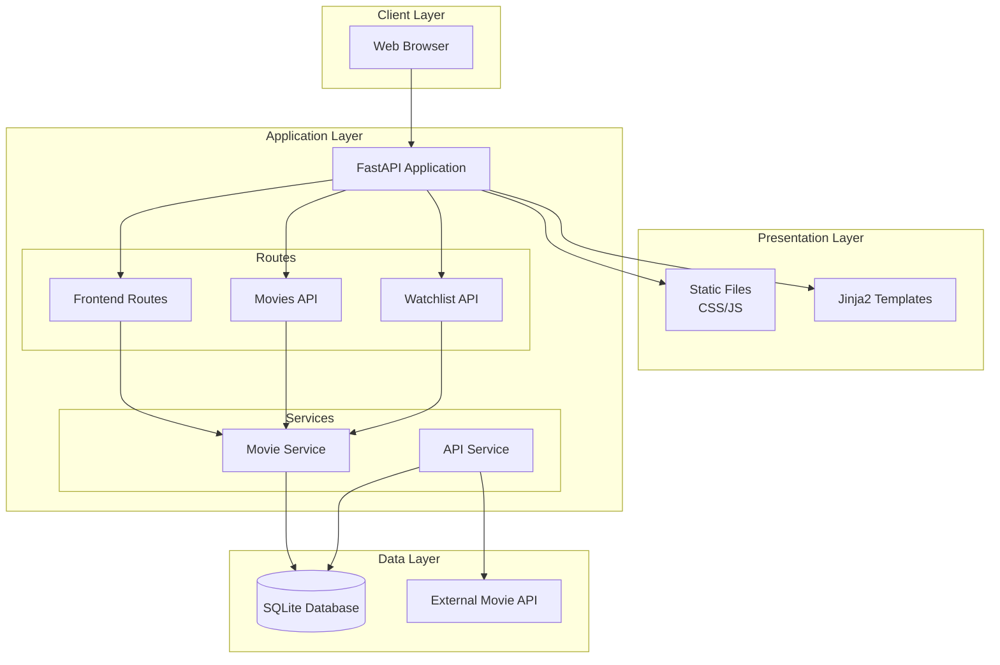
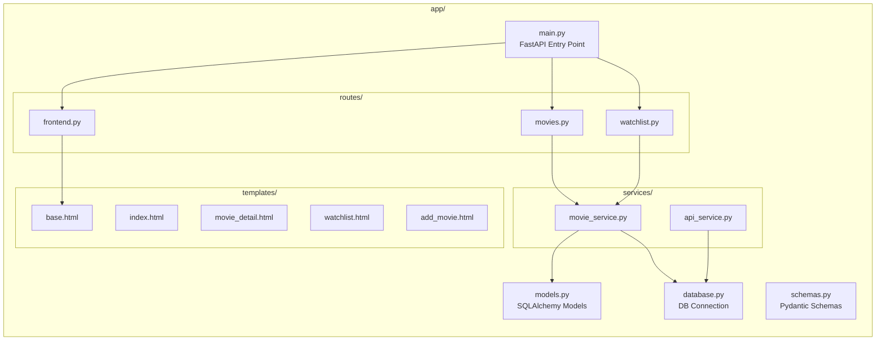
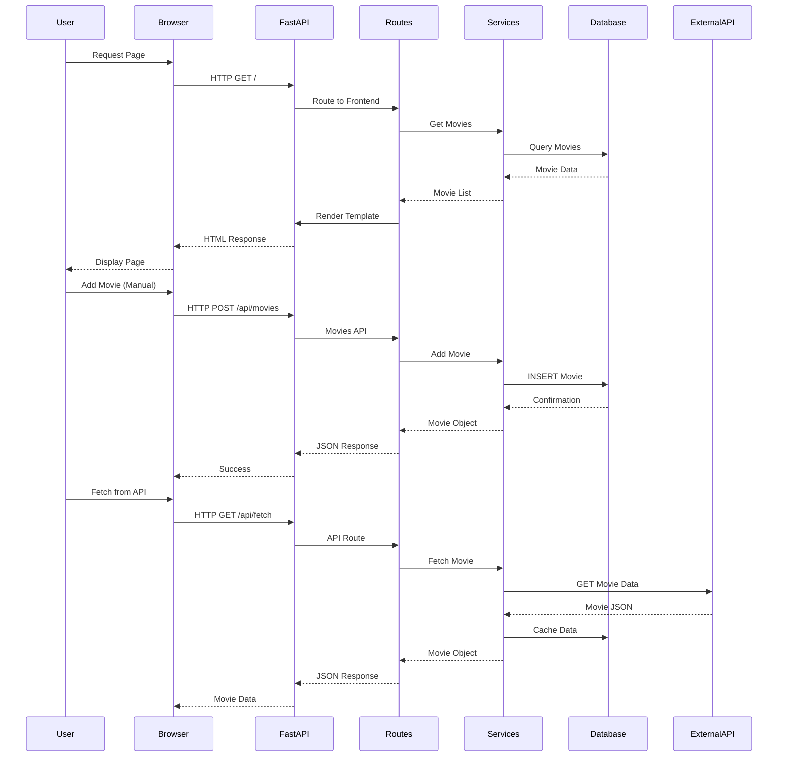
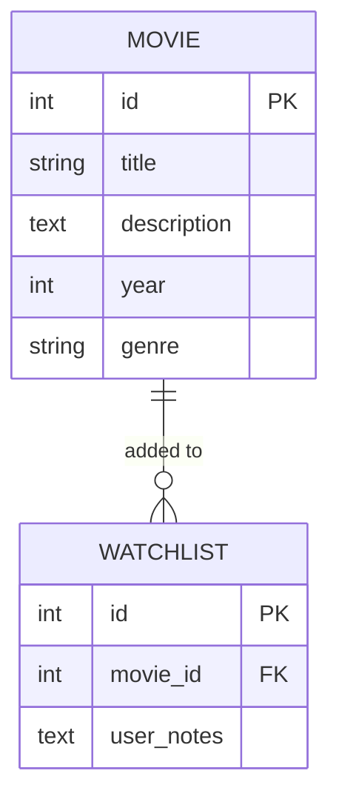

# Movie Watchlist - Architecture Documentation

## Overview

The Movie Watchlist application is a full-stack web application built with FastAPI, SQLAlchemy, and Jinja2 templates. This document describes the system architecture, components, and their interactions.

## High-Level Architecture



## Component Architecture



## Data Flow Diagram



## Database Schema



## Technology Stack

| Layer               | Technology   | Purpose                              |
| ------------------- | ------------ | ------------------------------------ |
| **Web Framework**   | FastAPI      | High-performance async web framework |
| **Template Engine** | Jinja2       | Server-side HTML rendering           |
| **ORM**             | SQLAlchemy   | Database abstraction and ORM         |
| **Database**        | SQLite       | Lightweight relational database      |
| **Styling**         | Tailwind CSS | Utility-first CSS framework          |
| **Interactivity**   | Alpine.js    | Lightweight JavaScript framework     |
| **HTTP Client**     | Requests     | External API communication           |
| **Server**          | Uvicorn      | ASGI server for FastAPI              |

## Directory Structure

```
movie-watchlist/
├── app/
│   ├── __init__.py           # App package init
│   ├── main.py               # FastAPI application entry point
│   ├── models.py             # SQLAlchemy ORM models
│   ├── database.py           # Database connection & session
│   ├── schemas.py            # Pydantic validation schemas
│   ├── routes/
│   │   ├── __init__.py
│   │   ├── movies.py         # Movie CRUD API endpoints
│   │   ├── watchlist.py      # Watchlist API endpoints
│   │   └── frontend.py       # HTML page routes
│   ├── services/
│   │   ├── __init__.py
│   │   ├── movie_service.py  # Movie business logic
│   │   └── api_service.py    # External API integration
│   ├── templates/            # Jinja2 HTML templates
│   └── tests/                # Unit tests
├── static/
│   ├── css/styles.css        # Custom styles
│   └── js/app.js             # Frontend JavaScript
├── data/                     # SQLite database storage
├── docs/                     # Documentation
├── requirements.txt          # Python dependencies
└── README.md                 # Project readme
```

## API Endpoints

### Movies API (`/api/movies`)

| Method | Endpoint           | Description        |
| ------ | ------------------ | ------------------ |
| GET    | `/api/movies/`     | List all movies    |
| POST   | `/api/movies/`     | Create a new movie |
| DELETE | `/api/movies/{id}` | Delete a movie     |

### Watchlist API (`/api/watchlist`)

| Method | Endpoint          | Description             |
| ------ | ----------------- | ----------------------- |
| GET    | `/api/watchlist/` | Get all watchlist items |
| POST   | `/api/watchlist/` | Add movie to watchlist  |

### Frontend Routes

| Method | Endpoint       | Description       |
| ------ | -------------- | ----------------- |
| GET    | `/`            | Homepage          |
| GET    | `/movies/{id}` | Movie detail page |
| GET    | `/watchlist`   | Watchlist page    |
| GET    | `/add`         | Add movie form    |

## Key Design Decisions

1. **Server-Side Rendering**: Using Jinja2 templates for SEO-friendly pages and simpler state management.

2. **Service Layer Pattern**: Business logic is encapsulated in service classes, keeping routes thin and testable.

3. **SQLite Database**: Lightweight and file-based, perfect for single-user applications without external database setup.

4. **API-First Design**: All data operations go through REST APIs, enabling future frontend flexibility.

5. **Dependency Injection**: FastAPI's `Depends()` is used for database session management.
