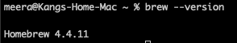
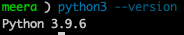
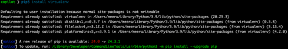
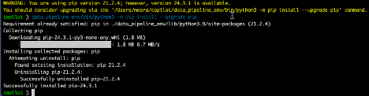
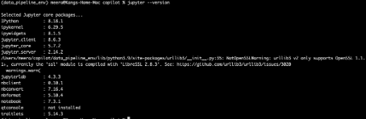
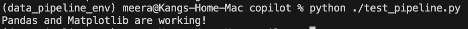
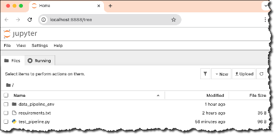
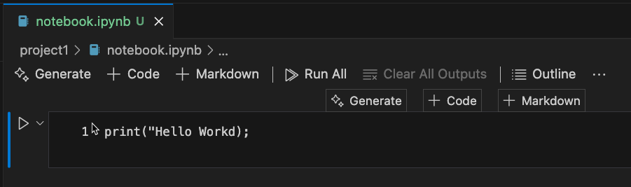

# Project 4: Data Analysis Pipeline with Python and Pandas (macOS)

<!-- markdownlint-disable MD033 MD029 MD010 MD007-->
<!-- vscode-markdown-toc -->
- [Project 4: Data Analysis Pipeline with Python and Pandas (macOS)](#project-4-data-analysis-pipeline-with-python-and-pandas-macos)
	- [1. MacOS Install Guide](#1-macos-install-guide)
		- [1.1. Validate Homebrew installed](#11-validate-homebrew-installed)
		- [1.2. Install Python](#12-install-python)
			- [1.2.1. Install Python using Homebrew](#121-install-python-using-homebrew)
			- [1.2.2. Verify the Python installation](#122-verify-the-python-installation)
			- [1.2.3. Install pip (Python package manager)](#123-install-pip-python-package-manager)
			- [1.2.4. Verify pip3 version](#124-verify-pip3-version)
		- [1.3. Set Up a Virtual Environment](#13-set-up-a-virtual-environment)
			- [1.3.1. Install virtualenv](#131-install-virtualenv)
	- [2. Project Setup](#2-project-setup)
		- [2.1. Install Required Python Libraries](#21-install-required-python-libraries)
		- [2.2. Install Jupyter Notebook](#22-install-jupyter-notebook)
		- [2.3. Test the Setup](#23-test-the-setup)
	- [3. Jupyter Password Creation](#3-jupyter-password-creation)
		- [3.1. Set the password](#31-set-the-password)
		- [3.2. Start Jupyter Notebook](#32-start-jupyter-notebook)
		- [3.3. Create `notebook.ipynb` File](#33-create-notebookipynb-file)
		- [3.4. Connect to a Jupyter Server (local)](#34-connect-to-a-jupyter-server-local)
	- [4. Install VS Code Extensions](#4-install-vs-code-extensions)
		- [4.1. Useful VSCode Extensions](#41-useful-vscode-extensions)
	- [5. Additional Notes (Optional)](#5-additional-notes-optional)
		- [5.1. To shut down Jupyter Notebook](#51-to-shut-down-jupyter-notebook)
		- [5.2. Notes on Jupyter Kernel Selection](#52-notes-on-jupyter-kernel-selection)
		- [5.3. GitHub Copilot Extension](#53-github-copilot-extension)
		- [5.4. Install VS Code in your Shell for Mac](#54-install-vs-code-in-your-shell-for-mac)
		- [5.5. To create a Jupyter config, follow these steps (optional)](#55-to-create-a-jupyter-config-follow-these-steps-optional)
	- [Code Runner change python to python3](#code-runner-change-python-to-python3)

<!-- vscode-markdown-toc-config
	numbering=true
	autoSave=true
	/vscode-markdown-toc-config -->
<!-- /vscode-markdown-toc -->

## 1. <a name='MacOSInstallGuide'></a>MacOS Install Guide

### 1.1. <a name='ValidateHomebrewinstalled'></a>Validate Homebrew installed



### 1.2. <a name='InstallPython'></a>Install Python

Ensure Python 3 is installed (preferably version 3.8 or higher).

#### 1.2.1. <a name='InstallPythonusingHomebrew'></a>Install Python using Homebrew

```bash
brew install python
```

#### 1.2.2. <a name='VerifythePythoninstallation'></a>Verify the Python installation

```bash
python3 --version
```



#### 1.2.3. <a name='InstallpipPythonpackagemanager'></a>Install pip (Python package manager)

```bash
python3 -m ensurepip --upgrade
```

#### 1.2.4. <a name='Verifypip3version'></a>Verify pip3 version

```bash
pip3 --version
```


### 1.3. <a name='SetUpaVirtualEnvironment'></a>Set Up a Virtual Environment

A virtual environment isolates dependencies for your project.

#### 1.3.1. <a name='Installvirtualenv'></a>Install virtualenv

```bash
pip3 install virtualenv
```



## 2. <a name='ProjectSetup'></a>Project Setup

- Create a virtual environment for the project:

```bash
mkdir -p copilot/project1
cd copilot/project1
python3 -m venv data_pipeline_env
```


- Activate the virtual environment:

```bash
source data_pipeline_env/bin/activate
```

### 2.1. <a name='InstallRequiredPythonLibraries'></a>Install Required Python Libraries

Install the libraries needed for the project.

Create a requirements.txt file with the following content

> [!TIP]
> If you clone the project, this file is already provided. You can copy or drag and drop it.
>

```text
pandas
matplotlib
seaborn
jupyter
radon
flake8
black
pandas-profiling
```

```bash
pip3 install -r requirements.txt
```

### 2.2. <a name='InstallJupyterNotebook'></a>Install Jupyter Notebook

Jupyter Notebook will be used to write and present the summary report.

Install Jupyter Notebook:

```bash
pip3 install notebook
```


Optionally upgrade pip if needed

```bash
data_pipeline_env/bin/python3 -m pip install --upgrade pip
```



Verify installation

```bash
jupyter --version
```



Verify Jupyter exist

```bash
pip3 list | grep jupyter
```


### 2.3. <a name='TesttheSetup'></a>Test the Setup

Create a new Python script to test your environment:

> [!TIP]
> If you clone the project, this file is already provided. You can copy or drag and drop it.

```bash
touch test_pipeline.py
```

Open the script in VSCode using the terminal using the below command or directly from VSC:

```bash
code test_pipeline.py
```

Add the following lines of code to test Pandas and Matplotlib:

```python
import pandas as pd
import matplotlib.pyplot as plt

print("Pandas and Matplotlib are working!")
```

Run the python code

```bash
python3 test_pipeline.py
```



## 3. <a name='JupyterPasswordCreation'></a>Jupyter Password Creation

### 3.1. <a name='Setthepassword'></a>Set the password

To create a password for a Jupyter Notebook server, you can use the jupyter notebook password command:
Run the command

```bash
jupyter notebook password
```

Enter and confirm your password

The hashed password will be saved in the `jupyter_notebook_config.json` file. You can use this password to log in instead of a token.

### 3.2. <a name='StartJupyterNotebook'></a>Start Jupyter Notebook

Launch Jupyter Notebook from the terminal:

```bash
jupyter notebook .
```

When prompted enter your password.


### 3.3. <a name='Createnotebook.ipynbFile'></a>Create `notebook.ipynb` File

Click Code


Add a `print("Hello World)` in the code block

Click Run



### 3.4. <a name='ConnecttoaJupyterServerlocal'></a>Connect to a Jupyter Server (local)

Connect to a Jupyter Server (local)
To connect to a remote Jupyter server:

Open the Kernel Picker button on the top right-hand side of the notebook (or run the Notebook: Select Notebook Kernel command from the Command Palette).


Select Another Kernel


Select Existing Jupyter


Enter <http://localhost:8888/>


Enter Jupyter Password and Enter


Confirm localhost (Enter again)


Select(ipykernel) - when prompted install the ipykernel for VS Code


Execute Cell by clicking the Run button in Jupyter Notebook


## 4. <a name='InstallVSCodeExtensions'></a>Install VS Code Extensions

### 4.1. <a name='UsefulVSCodeExtensions'></a>Useful VSCode Extensions

- Jupyter
- Python
- Data Wrangler
- Code Runner (Optional)
- GitHub Copilot
- GitHub Copilot Chat
- Python Analysis Tool (Optional)

## 5. <a name='AdditionalNotesOptional'></a>Additional Notes (Optional)

### 5.1. <a name='ToshutdownJupyterNotebook'></a>To shut down Jupyter Notebook

Press Ctrl+S
Shut down this Jupyter server (y/[n])? Y

### 5.2. <a name='NotesonJupyterKernelSelection'></a>Notes on Jupyter Kernel Selection

1. Activate your venv
2. Install ipykernel if needed
3. Select the Python3 ipykernel within VSCode

### 5.3. <a name='GitHubCopilotExtension'></a>GitHub Copilot Extension

- Open VSCode and go to the Extensions view (Cmd+Shift+X).
- Search for GitHub Copilot and install the extension.
- Authenticate your GitHub account to enable Copilot.

### 5.4. <a name='InstallVSCodeinyourShellforMac'></a>Install VS Code in your Shell for Mac

- Go to the top of VS and select menu View → Command Palette...
- Open the Command Palette via ⌘⇧P and type the shell command to find the Shell Command:

```text
Shell Command: Install `code` command in PATH
```

### 5.5. <a name='TocreateaJupyterconfigfollowthesestepsoptional'></a>To create a Jupyter config, follow these steps (optional)

1. Open a terminal.
2. Run the following command to generate a Jupyter configuration file:

    ```bash
    jupyter notebook --generate-config
    ```

3. Open the generated configuration file. The default location is `~/.jupyter/jupyter_notebook_config.py`.
4. Uncomment and modify the following lines to set a password:

    ```python
    c.NotebookApp.password = 'sha1:your_hashed_password'
    ```

5. To generate the hashed password, run the following command in the terminal:

    ```bash
    from notebook.auth import passwd
    passwd()
    ```

6. Copy the generated hashed password and paste it into the `NotebookApp.password` field in the configuration file.
7. Save the configuration file.

Now, when you start Jupyter Notebook, it will prompt you for the password you set.

## Code Runner change python to python3

Change the settings.json executor Map location


"code-runner.executorMap.python": {...
"python": "python3 -u",
...}


