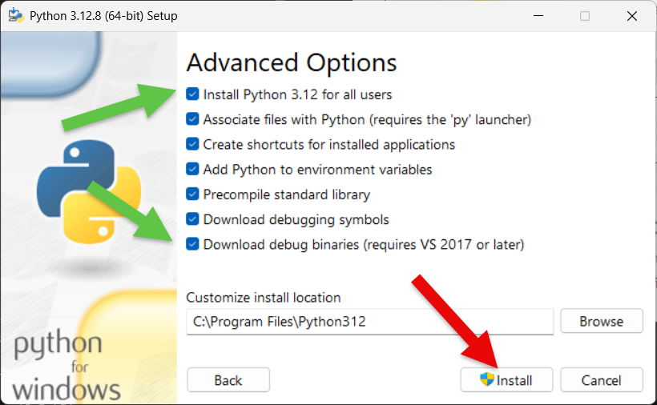
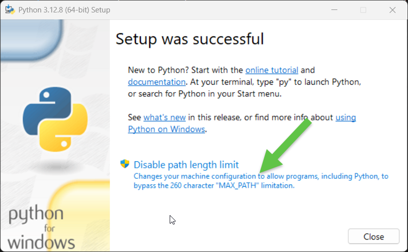
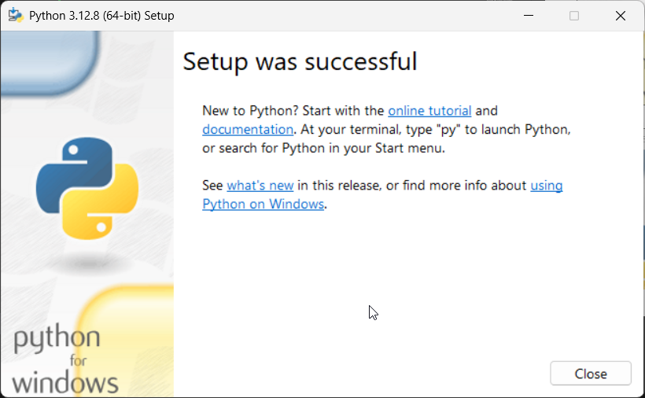
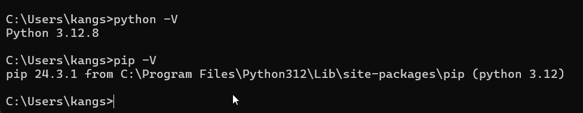
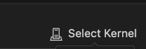
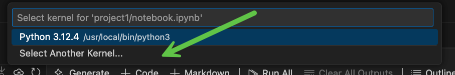
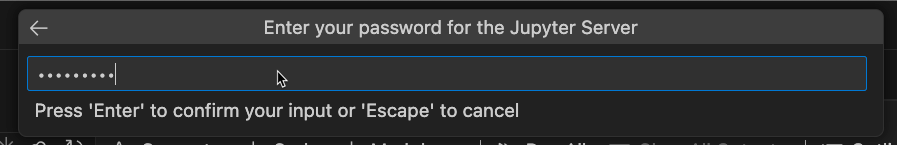
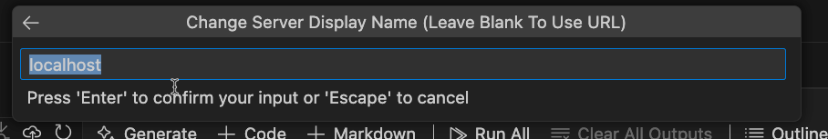

# Project 4: Data Analysis Pipeline with Python and Pandas (Windows 11)

<!-- markdownlint-disable MD033 MD029-->

<!-- vscode-markdown-toc -->
- [Project 4: Data Analysis Pipeline with Python and Pandas (Windows 11)](#project-4-data-analysis-pipeline-with-python-and-pandas-windows-11)
  - [1. 1. Install Python (on Windows)](#1-1-install-python-on-windows)
  - [2. Verify the Python Installation](#2-verify-the-python-installation)
  - [3. 1.3. Upgrade pip (Optional)](#3-13-upgrade-pip-optional)
  - [4. 2. Set Up a Virtual Environment](#4-2-set-up-a-virtual-environment)
    - [4.1. 2.1. Install virtualenv](#41-21-install-virtualenv)
    - [4.2. 3. Install Required Python Libraries](#42-3-install-required-python-libraries)
    - [4.3. 4. Install Jupyter Notebook](#43-4-install-jupyter-notebook)
    - [4.4. 5. Test the Setup](#44-5-test-the-setup)
    - [4.5. 6. Start Jupyter Notebook](#45-6-start-jupyter-notebook)
    - [4.6. 7. Install and Configure Visual Studio Code Extensions](#46-7-install-and-configure-visual-studio-code-extensions)
  - [5. Notes on Jupyter Kernel Selection](#5-notes-on-jupyter-kernel-selection)
    - [5.1. Notes on Jupyter Kernel Selection](#51-notes-on-jupyter-kernel-selection)
  - [6. Jupyter Password Creation](#6-jupyter-password-creation)
    - [6.1. Set the password](#61-set-the-password)
    - [6.2. Connect to a Jupyter Server (local)](#62-connect-to-a-jupyter-server-local)
  - [7. Additional Notes (Optional)](#7-additional-notes-optional)
    - [7.1. To shut down Jupyter Notebook](#71-to-shut-down-jupyter-notebook)
    - [7.2. Notes on Jupyter Kernel Selection](#72-notes-on-jupyter-kernel-selection)
    - [7.3. GitHub Copilot Extension](#73-github-copilot-extension)
    - [7.4. Install VS Code in your Shell for Mac](#74-install-vs-code-in-your-shell-for-mac)
    - [7.5. To create a Jupyter config, follow these steps (optional)](#75-to-create-a-jupyter-config-follow-these-steps-optional)

<!-- vscode-markdown-toc-config
	numbering=true
	autoSave=true
	/vscode-markdown-toc-config -->
<!-- /vscode-markdown-toc -->

## 1. <a name='InstallPythononWindows'></a>1. Install Python (on Windows)

Download Python from the official Python website: [Python Downloads](https://www.python.org/downloads/release/python-3128/).

TensorFlow only works with Python 3.9 to 3.12. You need to install 64 bit python windows.

- Run the installer and check the box to **add Python to PATH** before installing.
- Select "Customize installation" and ensure **pip** is selected for installation.

> [!WARNING]
> Make sure to customize and select all the checkboxes.


Select all the Advanced Options

- 

Disable path length limit

- 

Finally click Close

- 

After installation, open Command Prompt or PowerShell and run:

## 2. <a name='VerifythePythonInstallation'></a>Verify the Python Installation

```cmd
python --version
pip --version
```



Both commands should return the installed versions of Python and pip.

## 3. <a name='UpgradepipOptional'></a>1.3. Upgrade pip (Optional)

To ensure you have the latest version of pip, run:

```bash
python -m pip install --upgrade pip
```

## 4. <a name='SetUpaVirtualEnvironment'></a>2. Set Up a Virtual Environment

### 4.1. <a name='Installvirtualenv'></a>2.1. Install virtualenv

Run the following command to install the virtualenv package:

```bash
pip install virtualenv
```

2.2. Create a Virtual Environment
Create a project directory:

```bash
mkdir copilot\project1
cd copilot\project1
```

Create a virtual environment:

```bash
python -m venv data_pipeline_env
```

Activate the virtual environment:

```bash
data_pipeline_env\Scripts\activate
```

### 4.2. <a name='InstallRequiredPythonLibraries'></a>3. Install Required Python Libraries

Create a `requirements.txt` file with the following content:

> [!TIP]
> If you clone the project, this file is already provided. You can copy or drag and drop it.
>

```text
pandas
matplotlib
seaborn
jupyter
radon
flake8
black
pandas-profiling
```

Install the libraries:

```bash
pip install -r requirements.txt
```

### 4.3. <a name='InstallJupyterNotebook'></a>4. Install Jupyter Notebook

Run the following command to install Jupyter Notebook:

```bash
pip install notebook
```

To verify the installation:

```bash
jupyter --version
pip list | findstr jupyter
```

### 4.4. <a name='TesttheSetup'></a>5. Test the Setup

Create a new Python script to test your environment:

> [!TIP]
> If you clone the project, this file is already provided. You can copy or drag and drop it.
>

```bash
echo. > test_pipeline.py
```

Open test_pipeline.py in a text editor or Visual Studio Code and add the following:

```python
import pandas as pd
import matplotlib.pyplot as plt

print("Pandas and Matplotlib are working!")

```

Run the script to verify the setup:

```bash
python test_pipeline.py
```

### 4.5. <a name='StartJupyterNotebook'></a>6. Start Jupyter Notebook

Launch Jupyter Notebook from the terminal:

```bash
jupyter notebook
```

To shut down Jupyter Notebook:

Press Ctrl+C
Confirm shutdown with y

### 4.6. <a name='InstallandConfigureVisualStudioCodeExtensions'></a>7. Install and Configure Visual Studio Code Extensions

Download and install Visual Studio Code from the official [website](https://marketplace.visualstudio.com/VSCode).

Install the following extensions:

- Python
- Jupyter
- GitHub Copilot
- GitHub Copilot Chat (Optional)
- Code Runner (Optional)
- Set the default Python interpreter to your virtual environment.

Set the default Python interpreter to your virtual environment.

## 5. <a name='NotesonJupyterKernelSelection'></a>Notes on Jupyter Kernel Selection

Ensure your virtual environment is active.

Install ipykernel if needed:

```bash
pip install ipykernel
```

In Jupyter Notebook, select the appropriate kernel corresponding to your virtual environment.

### 5.1. <a name='NotesonJupyterKernelSelection-1'></a>Notes on Jupyter Kernel Selection

1. Activate your venv
2. Install ipykernel if needed
3. Select the Python3 ipykernel witin VSCode

## 6. <a name='JupyterPasswordCreation'></a>Jupyter Password Creation

### 6.1. <a name='Setthepassword'></a>Set the password

To create a password for a Jupyter Notebook server, you can use the jupyter notebook password command:
Run the command

```bash
jupyter notebook password
```

Enter and confirm your password (note down for later usage)

The hashed password will be saved in the jupyter_notebook_config.json file. You can use this password to log in instead of a token.

### 6.2. <a name='ConnecttoaJupyterServerlocal'></a>Connect to a Jupyter Server (local)

Connect to a Jupyter Server (local)
To connect to a remote Jupyter server:

Open the Kernel Picker button on the top right-hand side of the notebook (or run the Notebook: Select Notebook Kernel command from the Command Palette).


Select Another Kernel



Select Existing Jupyter


Enter <http://localhost:8888/>


Enter Jupyter Password and Enter



Confirm localhost (Enter again)



Select(ipykernel) - when prompted install the ipykernel for VS Code


Execute Cell by clicking the Run button in Jupyter Notebook


## 7. <a name='AdditionalNotesOptional'></a>Additional Notes (Optional)

### 7.1. <a name='ToshutdownJupyterNotebook'></a>To shut down Jupyter Notebook

Press Ctrl+S
Shut down this Jupyter server (y/[n])? Y

### 7.2. <a name='NotesonJupyterKernelSelection-1'></a>Notes on Jupyter Kernel Selection

1. Activate your venv
2. Install ipykernel if needed
3. Select the Python3 ipykernel within VSCode

### 7.3. <a name='GitHubCopilotExtension'></a>GitHub Copilot Extension

- Open VSCode and go to the Extensions view (Cmd+Shift+X).
- Search for GitHub Copilot and install the extension.
- Authenticate your GitHub account to enable Copilot.

### 7.4. <a name='InstallVSCodeinyourShellforMac'></a>Install VS Code in your Shell for Mac

- Go to the top of VS and select menu View → Command Palette...
- Open the Command Palette via ⌘⇧P and type the shell command to find the Shell Command:

```text
Shell Command: Install `code` command in PATH
```

### 7.5. <a name='TocreateaJupyterconfigfollowthesestepsoptional'></a>To create a Jupyter config, follow these steps (optional)

1. Open a cmd.
2. Run the following command to generate a Jupyter configuration file:

    ```bash
    jupyter notebook --generate-config
    ```

3. Open the generated configuration file. The default location is `C:\Users\<ChangeMe-username>\.jupyter\jupyter_notebook_config.py`.
4. Uncomment and modify the following lines to set a password:

    ```python
    c.NotebookApp.password = 'sha1:your_hashed_password'
    ```

5. To generate the hashed password, run the following command in the cmd:

    ```bash
    from notebook.auth import passwd
    passwd()
    ```

6. Copy the generated hashed password and paste it into the `c.NotebookApp.password` field in the configuration file.
7. Save the configuration file.

Now, when you start Jupyter Notebook, it will prompt you for the password you set.
